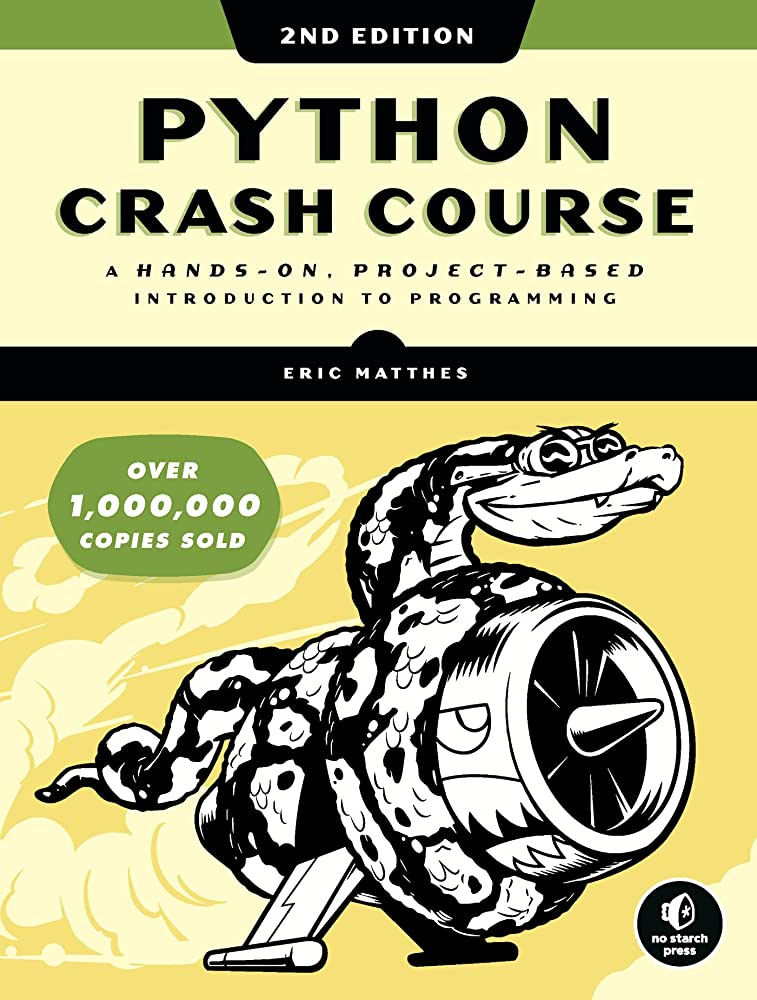

This project is a practice from the "Learn Python" by Eric Matthes book.

<h2>Alien Invasion</h2>

<h2>Description:</h2>
In the Alien Invasion project, we will use the Pygame package to write a 2D game in which the player must shoot down alien ships that fall on the screen with increasing speed and complexity. By the end of this project, you will know enough to create your own 2D game using Pygame.